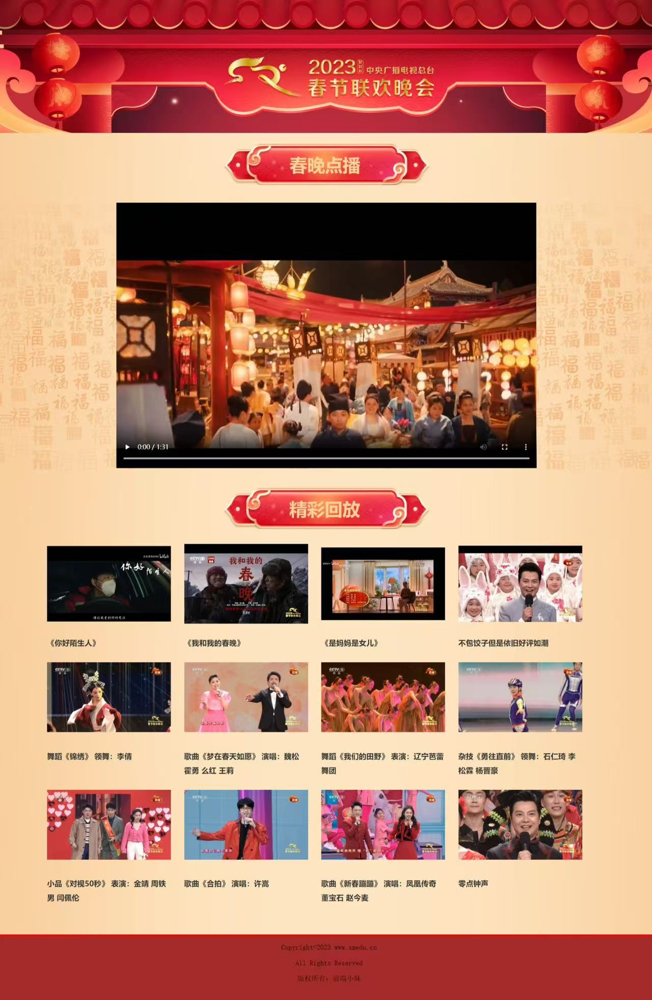
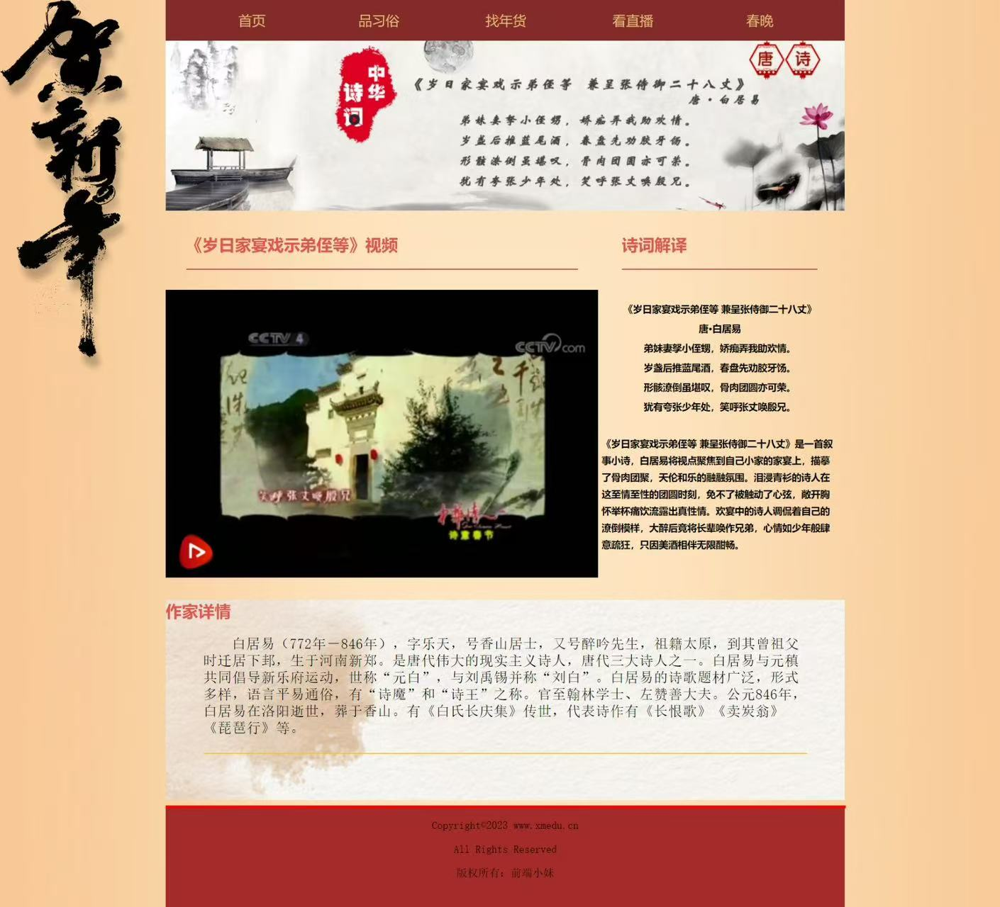

# 欢乐中国年 · 手写前端期末作品

这是我在前端课程期末大作业中，自己手写完成的一个春节主题网页作品，主题是 **“2024 欢乐中国年”**。

项目使用原生 **HTML、CSS 和 JavaScript**，练习了页面结构、样式布局、多页面导航、图片与视频展示，以及注册表单的基础交互。这里保留当时的页面代码和目录结构，作为个人前端学习与实践的记录。

## 页面效果

### 首页 · 欢乐中国年


### 春晚回顾



### 春节简介


### 文学记述 ·《岁日家宴戏示弟侄等》



### 文学记述 ·《元日》


## 页面内容

| 页面 | 内容 |
| --- | --- |
| `欢乐中国年.html` | 主页面，包含春节主题导航、图片展示、文化内容和侧边栏 |
| `春节简介.html` | 春节相关介绍 |
| `春晚回顾.html` | 春晚相关内容与视频展示 |
| `文学记述之《元日》.html` | 《元日》相关文学内容 |
| `文学记述之《岁日家宴戏示弟侄等》.html` | 《岁日家宴戏示弟侄等》相关文学内容 |
| `登录注册页.html` | 注册表单页面与前端校验练习 |

## 怎么打开

1. 点击本仓库的 **Code → Download ZIP**，下载后解压。
2. 进入 **`欢乐中国年`** 文件夹，双击其中的 **`欢乐中国年.html`**，用浏览器打开。
3. 保持 `css`、`img`、`js` 文件夹与 HTML 页面的位置不变，图片、样式和视频才能正常加载。

也可以使用 VS Code 的本地预览工具打开。项目不需要 npm 安装或打包。

## 目录结构

```text
欢乐中国年/
├── README.md             项目介绍与效果截图
├── screenshots/          页面效果截图
├── 欢乐中国年.html
├── 春节简介.html
├── 春晚回顾.html
├── 登录注册页.html
├── 文学记述之《元日》.html
├── 文学记述之《岁日家宴戏示弟侄等》.html
├── css/                  页面样式、图标与字体文件
├── img/                  图片、动图和视频素材
└── js/                   注册页面交互脚本
```

## 项目说明

- 这是我自己动手编写页面结构、样式和基础交互的前端课程作品，未使用 React、Vue 等前端框架。
- 当前保留课程作业时的实现，部分导航和按钮仍是展示占位；注册页面属于前端练习，没有配套的真实用户账号系统。
- 仓库保留网页所用的图片、视频和图标字体素材；“手写前端”指页面代码的编写，不表示这些素材全部由本人原创。
- 本次上传包含原项目中的网页代码与资源文件，不包含 Word 作业文档。
